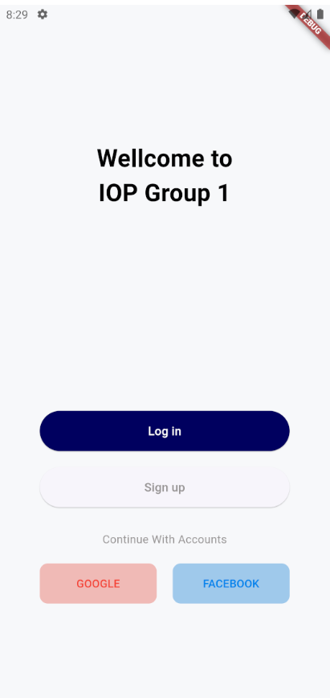
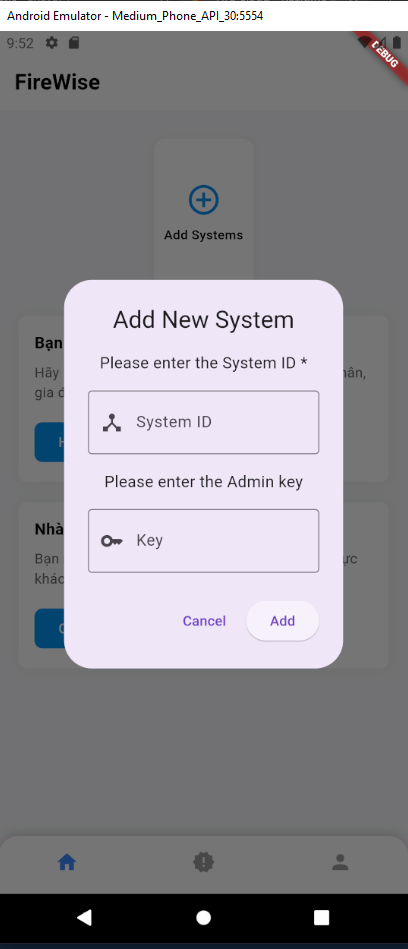
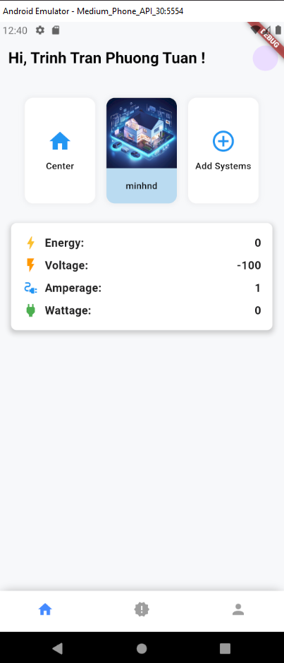
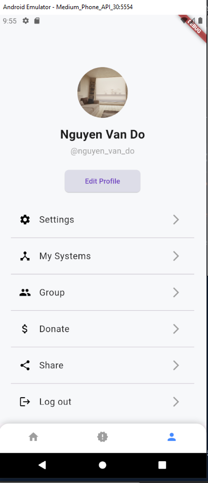
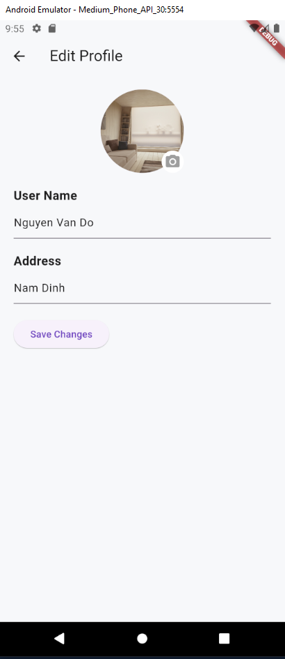

# Flutter App


## Getting Started

### Requirements

Before getting started, ensure you have the following installed:

- [Flutter SDK](https://docs.flutter.dev/get-started/install)
- [Android Studio](https://developer.android.com/studio)
- [Visual Studio Code](https://code.visualstudio.com/)
- For demo purposes: Use either the Android Studio emulator or connect a physical device via USB debugging with Developer permissions enabled.

### Installation

1. **Clone the Repository**

   ```bash
   git clone <link>
   ```

2. **Navigate to the project directory**

   ```bash
   cd firewise_app
   ```

3. **Install dependencies**

   ```bash
   flutter pub get
   ```

4. **Run the app on an emulator or physical device**

   ```bash
   flutter run
   ```

### Build for Android:

1. Generate APK file:
   ```bash
   flutter build apk
   ```
   This command will generate an APK file in the `build/app/outputs/apk/release` directory, suitable for installation on Android devices.

2. Generate App Bundle file:
   ```bash
   flutter build appbundle
   ```
   This command will generate an App Bundle (`.aab`) file in the `build/app/outputs/bundle/release` directory. The App Bundle is the recommended format for uploading the app to the Google Play Store.

### Build for iOS:

1. Generate iOS build:
   ```bash
   flutter build ios
   ```
   This command will generate a `build/ios` directory containing all necessary files for deploying the app to an iOS device or packaging it for submission to the App Store.

2. Run release version on iOS device:
   ```bash
   flutter run --release
   ```

## Screenshots

Here are some screenshots illustrating the app:
## Screenshots

Here are some screenshots illustrating the app:

| Welcome Screen              | Login Screen                |
|-----------------------------|-----------------------------|
|  |  |

| Register Screen             | Add New System              |
|-----------------------------|-----------------------------|
|  |  |

| Home Screens                |                             |
|-----------------------------|-----------------------------|
|  |  |
|  |                             |

| Profile Screen              | Edit Profile Screen         |
|-----------------------------|-----------------------------|
|  | 
